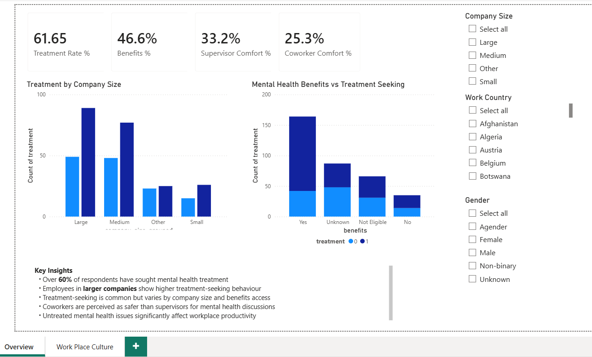
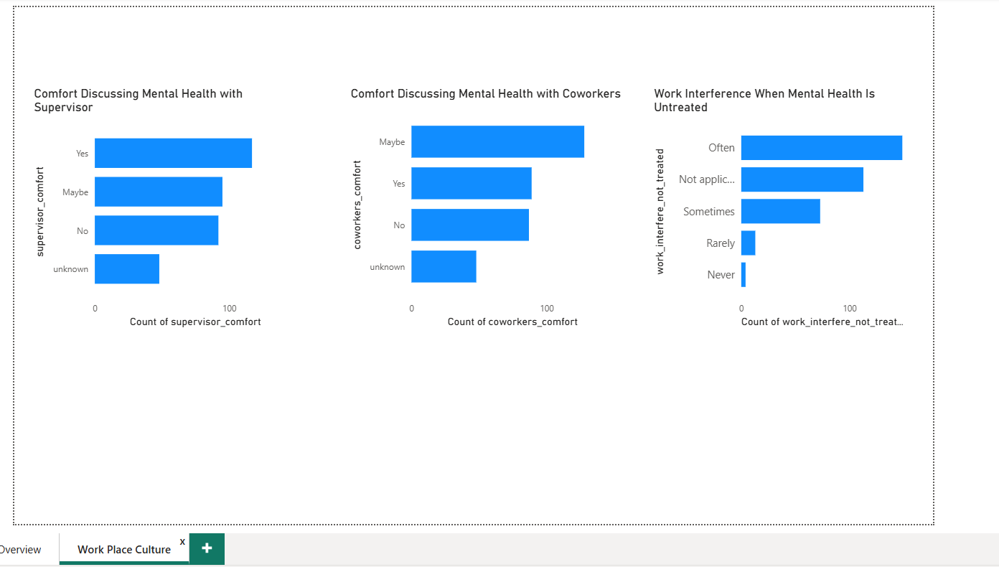

# mental-health-analytics-powerbi
Interactive Power BI dashboard analysing workplace mental health trends
# Mental Health Analytics Dashboard (Power BI)

## Project Overview
This project analyses workplace mental health trends using survey data. 
The dashboard explores treatment-seeking behaviour, organisational factors, 
and the impact of untreated mental health issues on workplace productivity.

## Tools & Technologies
- Power BI (DAX, Power Query, interactive dashboards)
- SQL (data exploration)
- Python (data cleaning & preprocessing)

## Key Features
- KPI cards showing treatment rate and workplace comfort levels
- Analysis of treatment-seeking behaviour by company size and benefits access
- Workplace culture insights comparing supervisor vs coworker comfort
- Interactive slicers for company size, country, and gender

## Key Insights
- Over 60% of respondents have sought mental health treatment
- Larger organisations show higher treatment-seeking behaviour
- Access to mental health benefits is associated with higher treatment uptake
- Employees are more comfortable discussing mental health with coworkers than supervisors
- Untreated mental health issues frequently interfere with work performance

## Screenshots

## Dataset
Mental Health in Tech Survey (OSMI)

## Author
Hema Priya Pandhiti
